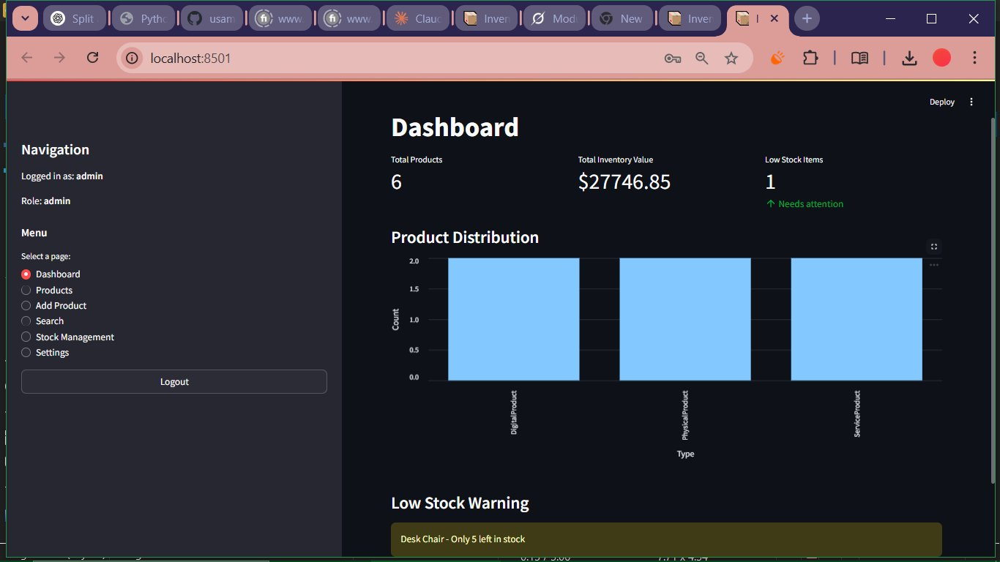
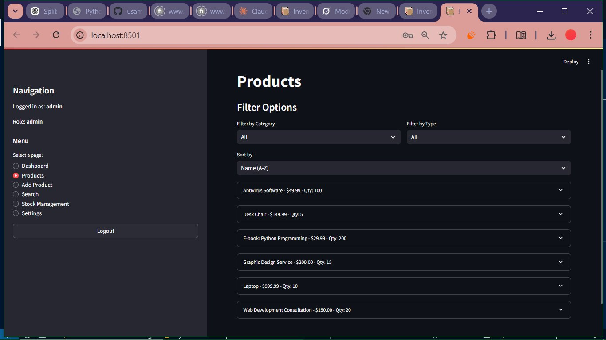

# 📦 Inventory Management System

Welcome to the Inventory Management System, a powerful, user-friendly web application built with Python and Streamlit to manage your inventory with ease! Whether you're tracking physical products, digital assets, or services, this system offers a modern interface, secure authentication, and robust features to streamline your inventory operations. 🚀

This project is proudly hosted on GitHub: [usama7871/Inventory_Management_system](https://github.com/usama7871/Inventory_Management_system). Star ⭐ and fork 🍴 the repo to explore and contribute!

---

## ✨ Features

### 🔐 User Authentication
- Secure login and signup with password hashing.
- Role-based access (admin, manager, user).
- Password change functionality for all users.
- Admin-only user management (add new users with roles).

### 📋 Inventory Management
- Support for multiple product types: Physical 📦, Digital 💻, and Service 🛠️.
- Add, edit, and remove products with type-specific attributes (e.g., weight for physical, file size for digital).
- Search products by name, category, or ID.
- Track stock levels and manage bulk stock adjustments.

### 📊 Dashboard Insights
- Visualize total products, inventory value, and low-stock alerts.
- Bar chart showing product type distribution.
- Real-time low-stock warnings for proactive management.

### 💾 Data Persistence
- Store user and inventory data in JSON files for simplicity.
- Export inventory data to JSON for backups.
- Import JSON data to restore or migrate inventory.

### 🌟 Modern UI
- Built with Streamlit for a responsive, interactive web interface.
- Filter and sort products by category, type, name, price, or quantity.
- Expandable product details with action buttons (edit, add stock, remove).

---

## 🛠️ Tech Stack
- **Python 3.8+**: Core programming language.
- **Streamlit**: Web framework for the UI.
- **Hashlib**: For secure password hashing.
- **JSON**: For data storage and export/import.
- **UUID**: For generating unique product IDs.
- **Datetime**: For tracking product creation and updates.

---

## 📸 Screenshots

### 🔐 Login Page


### 📊 Dashboard


### 📦 Products Page


---

## 🚀 Getting Started

Follow these steps to set up and run the Inventory Management System locally.

### ✅ Prerequisites
- Python 3.8 or higher installed ([Download Python](https://www.python.org/downloads/)).
- `pip` for installing dependencies.
- A code editor like **VS Code** (recommended).

### 📥 Installation

#### 1. Clone the Repository
```bash
git clone https://github.com/usama7871/Inventory_Management_system.git
cd Inventory_Management_system
```

#### 2. Create a Virtual Environment (optional but recommended)
```bash
python -m venv venv
# On Linux/macOS:
source venv/bin/activate
# On Windows:
venv\Scripts\activate
```

#### 3. Install Dependencies
```bash
pip install -r requirements.txt
```
If `requirements.txt` is not present:
```bash
pip install streamlit
```

#### 4. Run the Application
```bash
streamlit run app.py
```

#### 5. Access the App
Open your browser and navigate to:
```
http://localhost:8501
```
Use the default admin credentials:
- **Username**: `admin`
- **Password**: `admin123`

---

## 📂 Project Structure
```
Inventory_Management_system/
├── app.py              # Main Streamlit application
├── auth.py             # User authentication and management
├── inventory.py        # Inventory and product management
├── product.py          # Product classes and exceptions
├── user_data.json      # Stores user data (auto-generated)
├── inventory_data.json # Stores inventory data (auto-generated)
├── README.md           # Project documentation
├── requirements.txt    # Dependencies (optional)
└── screenshots/        # Screenshots for README
    ├── 1.jpg           # Login page screenshot
    ├── 2.jpg           # Dashboard screenshot
    ├── 3.jpg           # Products page screenshot
```

---

## 🧑‍💻 Usage

### 🔐 Login or Sign Up
- Log in with existing credentials or create a new account.
- Admins can manage users in the Settings page.

### 🧭 Navigate the App
- Use the sidebar to switch between Dashboard, Products, Add Product, Search, Stock Management, and Settings.
- Each page offers specific functionality, like viewing metrics, editing products, or importing data.

### 📦 Manage Inventory
- Add products with type-specific details (e.g., dimensions for physical products).
- Search and filter products to find what you need.
- Adjust stock levels for low-stock items or in bulk.

### 📤 Export/Import Data
- Export your inventory to JSON for backups.
- Import JSON files to restore or migrate data (⚠️ this overwrites existing data).

---

## 🤝 Contributing

We welcome contributions to make this project even better!

### Steps to Contribute
1. Fork the repository: [usama7871/Inventory_Management_system](https://github.com/usama7871/Inventory_Management_system).
2. Create a new branch:
```bash
git checkout -b feature/your-feature
```
3. Make your changes and commit:
```bash
git commit -m "Add your feature"
```
4. Push to your branch:
```bash
git push origin feature/your-feature
```
5. Open a Pull Request on GitHub.

Please follow the Code of Conduct and check the Issues tab for tasks.

---

## 📜 License

This project is licensed under the **MIT License**. See the [LICENSE](LICENSE) file for details.

---

## 🙌 Acknowledgements

- **Streamlit**: For an awesome framework to build web apps with Python.
- **Python Community**: For the amazing libraries and tools.
- **You**: For checking out this project! 🎉

---

## 🌟 Show Your Support

If you like this project, give it a ⭐ on GitHub: [usama7871/Inventory_Management_system](https://github.com/usama7871/Inventory_Management_system).

Feel free to share it with others or contribute to make it even better!

📬 For questions, suggestions, or feedback, open an issue on the repo or reach out via GitHub. Let's manage inventory like pros! 💼
